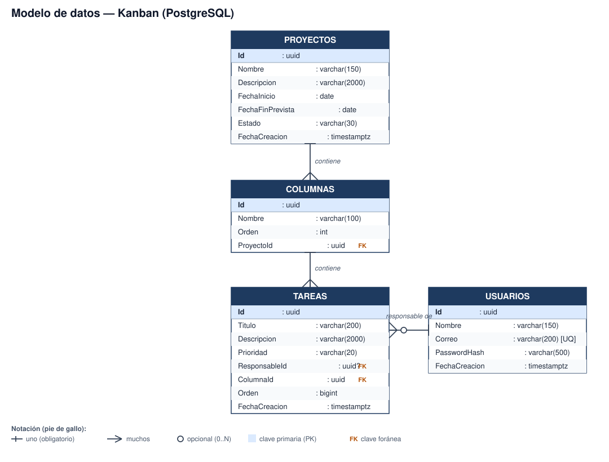

# Kanban — Plataforma de gestión ágil de proyectos

Aplicativo web para la gestión de proyectos ágiles: creación de proyectos, configuración
del flujo de trabajo mediante columnas y administración de tareas sobre un tablero
kanban con sincronización en tiempo real y reportes exportables en PDF y Excel.

## Stack tecnológico

| Componente | Tecnología |
|---|---|
| Frontend | Angular 17 + TypeScript + SCSS, PrimeNG con plantilla Sakai |
| Backend | .NET 8, C#, API RESTful |
| Persistencia | Entity Framework Core, migraciones incrementales |
| Base de datos | PostgreSQL |
| Reporte PDF | QuestPDF |
| Reporte Excel | ClosedXML |
| Tiempo real | SignalR |
| Contenedores | Docker / Docker Compose |

## 1. Ejecución con Docker (recomendado)

Requisitos: Docker y Docker Compose.

```bash
cp .env.example .env
docker compose up --build
```

Servicios expuestos (puertos por defecto, configurables en `.env`):

- Frontend: http://localhost:4200
- API: http://localhost:5080 (Swagger en `/swagger` solo en entorno Development)
- PostgreSQL: localhost:5432

Al arrancar, la API aplica automáticamente las migraciones pendientes contra la base de
datos (incluida la migración semilla de usuarios), por lo que no se requiere ningún paso
manual adicional. Los valores de `.env.example` ya están completos para que la solución
funcione de inmediato; en un despliegue real, `JWT_SECRET` y `PASSWORD_PEPPER` deben
reemplazarse por secretos propios.

### Usuarios precargados

| Correo | Contraseña |
|---|---|
| `ana.torres@kanban.dev` | `Kanban#2026` |
| `luis.pena@kanban.dev` | `Kanban#2026` |

## 2. Ejecución en local sin Docker

### Backend

Requisitos: .NET 8 SDK, PostgreSQL accesible.

```bash
cd backend
# Variables de entorno mínimas (ajustar a tu Postgres local):
export ConnectionStrings__DefaultConnection="Host=localhost;Port=5432;Database=kanban;Username=postgres;Password=postgres"
export Jwt__Secret="una-cadena-larga-y-secreta"
export PasswordHasher__Pepper="kanban-default-pepper-DEV-ONLY-CHANGE-IN-PRODUCTION"
export Cors__AllowedOrigins__0="http://localhost:4200"

dotnet run --project src/Kanban.Api/Kanban.Api.csproj
```

> El valor de `PasswordHasher__Pepper` de arriba coincide con el usado para generar los
> hashes de los usuarios semilla; si se cambia, el login de los usuarios precargados
> dejará de funcionar hasta regenerar sus hashes.

Las migraciones se aplican automáticamente al iniciar. Para gestionarlas manualmente:

```bash
dotnet tool install --global dotnet-ef
dotnet ef migrations add NombreMigracion --project src/Kanban.Infrastructure --startup-project src/Kanban.Api
dotnet ef database update --project src/Kanban.Infrastructure --startup-project src/Kanban.Api
```

### Frontend

Requisitos: Node.js 18+, Angular CLI.

```bash
cd frontend
npm install
npm start
```

La app queda disponible en http://localhost:4200. La URL de la API y del hub de SignalR
se configuran en `src/assets/config.json` (leído en tiempo de ejecución, ver sección de
decisiones arquitectónicas).

### Pruebas automatizadas

```bash
# Backend (18 pruebas)
cd backend
dotnet test tests/Kanban.UnitTests/Kanban.UnitTests.csproj

# Frontend (14 pruebas)
cd frontend
npm run test -- --watch=false --browsers=ChromeHeadless
```

## 3. Decisiones arquitectónicas

### 3.1 Arquitectura hexagonal (backend)

El backend se organiza en cuatro proyectos con dependencias unidireccionales hacia el
dominio:

```
Kanban.Domain          → entidades, enums y servicios de dominio puros, sin dependencias externas
Kanban.Application      → casos de uso (Services), DTOs y puertos (interfaces) de persistencia,
                          seguridad, tiempo real y reportes
Kanban.Infrastructure   → adaptadores: EF Core/PostgreSQL, JWT, PBKDF2, SignalR, QuestPDF, ClosedXML
Kanban.Api              → adaptador de entrada: controladores REST, middleware, Program.cs
```

Application define los puertos de salida (`IProyectoRepository`, `IPasswordHasher`,
`IBoardNotifier`, `IReportExporter`, etc.) y los implementa exclusivamente en
Infrastructure, de modo que la lógica de negocio no conoce PostgreSQL, SignalR ni las
librerías de reporte concretas. Esto permite, por ejemplo, sustituir SignalR por otra
tecnología de tiempo real sin tocar los casos de uso.

### 3.2 Separación por capas (frontend)

El frontend usa separación por capas en lugar de hexagonal estricta, por ser más
pragmática para una SPA de este tamaño:

```
core/
  api/        → servicios de acceso a datos (uno por recurso: proyectos, columnas, tareas, reportes, usuarios)
  auth/       → AuthService, guard de ruta, interceptor HTTP
  config/     → AppConfigService (configuración runtime)
  models/     → interfaces que reflejan los DTOs del backend
  realtime/   → BoardHubService (cliente SignalR)
features/
  auth/login
  proyectos/  → listado paginado + CRUD
  tablero/    → tablero kanban, drag & drop, filtros, reportes
```

Los componentes de `features` no llaman a `HttpClient` directamente ni conocen URLs: solo
consumen los servicios de `core/api`, que a su vez leen la URL base desde
`AppConfigService`.

### 3.3 Configuración externa, sin direcciones embebidas

- **Backend**: toda configuración sensible (cadena de conexión, secreto JWT, pepper,
  orígenes CORS) se lee de variables de entorno (`appsettings.json` las declara vacías;
  nunca se versionan valores reales).
- **Frontend**: en lugar de los `environment.ts` estáticos de Angular (que quedan fijos en
  el build), la URL de la API y del hub de SignalR se leen en **tiempo de ejecución**
  desde `src/assets/config.json`, cargado antes de bootstrap mediante un
  `APP_INITIALIZER` (`AppConfigService`). En Docker, el contenedor de la SPA regenera ese
  archivo a partir de las variables de entorno `API_URL` / `SIGNALR_URL` justo antes de
  servir los estáticos con nginx (`docker-entrypoint.d/40-runtime-config.sh`). Esto
  permite reutilizar la misma imagen en distintos entornos sin reconstruir el build de
  Angular.

### 3.4 Tecnología de tiempo real: SignalR

**Elegida:** SignalR sobre WebSockets.

**Justificación:** integración nativa con ASP.NET Core (autenticación JWT compartida con
la API REST sin infraestructura adicional), reconexión automática del lado del cliente, y
soporte de grupos (`board:{proyectoId}`) que resuelve directamente el requisito de que una
sesión solo reciba eventos de los tableros a los que está suscrita.

**Alternativas descartadas:**

- **WebSocket puro**: requeriría implementar manualmente reconexión, framing de mensajes,
  autenticación y agrupamiento por tablero — SignalR ya resuelve todo esto.
- **SSE (Server-Sent Events)**: es unidireccional (servidor → cliente); el cliente igual
  necesitaría la API REST para las acciones, lo cual es viable, pero SignalR ofrece un
  modelo de programación (`HubConnection.on/invoke`) más simple para este caso sin
  ninguna desventaja relevante aquí.

El token JWT de sesión se reutiliza para el hub: como el navegador no permite cabeceras
personalizadas en la negociación WebSocket, el token se envía como query string
`?access_token=...`, y `JwtBearerEvents.OnMessageReceived` lo acepta únicamente para rutas
bajo `/hubs` (ver `Program.cs`).

### 3.5 Estrategia de índices de ordenamiento (drag & drop)

Se usa **indexación fraccionada por huecos** (`OrdenTareaCalculator`, en
`Kanban.Domain.Services`): cada tarea guarda un `bigint` con separación amplia (huecos de
65536) respecto a sus vecinas. Mover o insertar una tarea normalmente solo requiere
calcular el promedio entre el orden de la tarea anterior y la siguiente, sin renumerar el
resto de la columna. Cuando el hueco entre dos vecinas se agota (diferencia ≤ 1), se
dispara un **rebalanceo** que reasigna órdenes equiespaciados a toda la columna.

Esta estrategia se eligió sobre alternativas como reordenar por índices enteros
consecutivos (1, 2, 3…) porque esa alternativa exige reescribir en cada movimiento todas
las filas posteriores a la posición de destino; con huecos, la inmensa mayoría de los
movimientos son una sola escritura.

La función `OrdenTareaCalculator.CalcularNuevaPosicion` está cubierta por pruebas
unitarias (`OrdenTareaCalculatorTests`), incluyendo el caso obligatorio del cálculo de la
nueva posición al reordenar.

### 3.6 Patrón de exportación dual (PDF / Excel)

Se aplica **Strategy + Factory**:

- `IReportExporter` es la interfaz Strategy (`ExportarAsync(ReporteProyectoDto)`), con una
  implementación por formato: `PdfReportExporter` (QuestPDF) y `ExcelReportExporter`
  (ClosedXML).
- `ReportExporterFactory` selecciona la estrategia en función del formato solicitado,
  resuelta vía inyección de dependencias (`IEnumerable<IReportExporter>`).
- `ReporteService` obtiene los datos con una única consulta (`IReporteRepository.
  ObtenerReporteProyectoAsync`, un solo `SELECT` proyectado directamente al DTO
  compartido `ReporteProyectoDto`) y delega la generación de bytes al exportador elegido.

**Extensibilidad comprobada:** agregar un tercer formato (por ejemplo, CSV) consiste en
crear una nueva clase que implemente `IReportExporter` y registrarla en
`DependencyInjection.AddInfrastructure`; ni `ReportExporterFactory`, ni `ReporteService`,
ni los exportadores existentes requieren modificación alguna.

### 3.7 Autenticación y seguridad

- Contraseñas con **PBKDF2-HMACSHA256** (100 000 iteraciones), salt aleatorio de 16 bytes
  almacenado junto al hash, y **pepper** de servidor (secreto compartido, nunca
  almacenado) tomado de variable de entorno — algoritmo con salt y pepper recomendado por
  el enunciado (`Kanban.Infrastructure.Security.PasswordHasher`).
- JWT firmado con HMAC-SHA256, validado en cada endpoint de negocio (`[Authorize]`) y en
  el hub de SignalR.
- Guard de ruta en Angular (`authGuard`) que impide navegar al tablero sin sesión válida.
- Interceptor HTTP (`authInterceptor`) que adjunta el token a cada petición dirigida a la
  API y, ante una respuesta 401, cierra la sesión local y redirige al login.
- CORS restringido a los orígenes declarados por variable de entorno.

## 4. Modelo de datos



Migraciones incrementales (código generado por EF Core) en
`backend/src/Kanban.Infrastructure/Persistence/Migrations`:

1. `InitialCreate` — esquema base (usuarios, proyectos, columnas, tareas).
2. `SeedUsuarios` — inserta los dos usuarios precargados con contraseña hasheada.

## 5. Funcionalidades opcionales implementadas

- Filtros del tablero por responsable y por prioridad (aplicados también sobre las
  tareas visibles en el tablero).
- Búsqueda de tareas por texto (título).
- Indicador de usuarios conectados al tablero: `ConnectedUsersTracker` (Infrastructure)
  registra las conexiones activas por tablero y `BoardHub` difunde el evento
  `UsuariosConectados` al conectarse/desconectarse; el frontend muestra el conteo con
  tooltip de nombres en el encabezado del tablero.

## 6. Declaración de uso de asistentes de inteligencia artificial

Se utilizó **Claude Code (Anthropic)** como asistente de desarrollo a lo largo de todo el
ejercicio: diseño de la arquitectura hexagonal del backend, implementación de entidades de
dominio y casos de uso, configuración de EF Core y migraciones, autenticación JWT,
integración de SignalR, exportadores PDF/Excel, estructura del frontend Angular sobre la
plantilla Sakai, componentes del tablero kanban con drag & drop, pruebas unitarias de
ambos proyectos, Dockerfiles, `docker-compose.yml` y este README. Todo el código fue
revisado, ejecutado y validado manualmente contra una base de datos PostgreSQL real
durante el desarrollo (incluyendo pruebas end-to-end de login, CRUD, movimiento de
tareas, propagación en tiempo real con un cliente SignalR real y descarga de ambos
reportes) antes de darlo por terminado.

## 7. Decisiones no especificadas en el reto

- **Nombres de rutas y DTOs en español**, consistente con el dominio de negocio descrito
  en el enunciado.
- **Paginación de proyectos**: tamaño de página por defecto 10, máximo 100 por página,
  validado en el servidor.
- **Reordenación de columnas**: se implementó con botones (mover a la izquierda/derecha)
  en lugar de arrastrar y soltar, ya que el enunciado solo exige drag & drop
  explícitamente para tareas (secciones 6.4 y 6.6); la operación usa el mismo endpoint
  `PUT /columnas/reordenar` que se usaría con drag & drop.
- **Formato de fecha** en la API: `DateOnly` (`yyyy-MM-dd`) para fechas de proyecto,
  `DateTime` UTC para marcas de tiempo.
